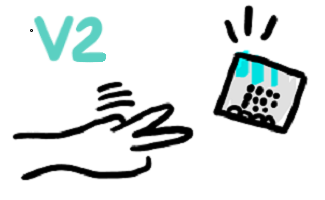

# Rock Paper Scissors

## {Introduction @unplugged}




Turn your micro:bit into a **Rock Paper Scissors** game that you can play with your friends!

## {Step 1}

First we need to make a variable to keep track of whether we have a Rock, Paper or Scissors in our hand. A variable is a container for storing values. Click on the ``||variables:Variables||`` category in the Toolbox. Click on the **Make a Variable** button. Give your new variable the name "hand" and click Ok.


## {Step 2}

Click on the ``||variables:Variables||`` category in the Toolbox again. You'll notice that there are some new blocks that have appeared. Drag a ``||variables:set hand||`` block into the ``||input:on shake||`` block. We'll start our Rock Paper Scissors game when we shake 👋 our micro:bit.

```blocks
let hand = 0;
input.onGesture(Gesture.Shake, function() {
    hand = 0
})
